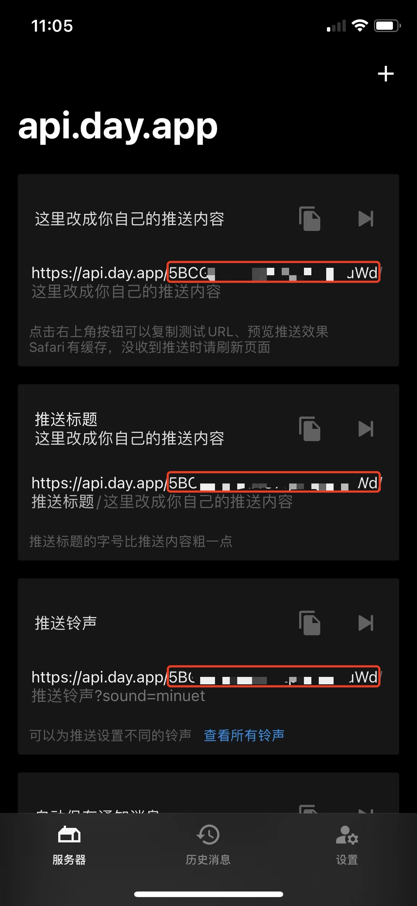

# dingdong-helper
叮咚抢购助手

本项目Fork `https://github.com/hzz765/robFoodDD`
```
修改了轮询间隔时间为 `1毫秒` 慎用！！！
修改了购物车中无有效商品时重新获取购物车数据
修改了提交订单的轮询次数为100次
```

## 使用方法
> 注意：需要具有抓包经验，获取到叮咚登录Cookie才可以使用

1、下载并安装Golang `https://golang.google.cn/dl/`

2、抓包获取叮咚登录Cookie（我用的是Charles），形式为```"DDXQSESSID xxxxxxxxxxx"```

3、在 `main.go` 的 `main` 函数中修改该行代码
```
err := session.InitSession("DDXQSESSID=xxxxxxxxxxx", "xxxxxxxxxxx")
```

其中第一个参数为叮咚登录Cookie，第二个参数为通知用的Bark id，手机下载Bark后从APP界面获取，下图标注的就是Bark id，App中有复制

> 建议设置下提醒，以免错过付款时间，不设置Bark id也是可以使用的，只是没有提醒



4、保存后在项目目录下运行命令
```
go run main.go
```

5、按照提示输入对应的数字即可抢购

6、祝好运
